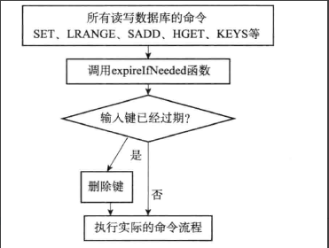

# Redis
## 关于Redis 

redi是一个开源的使用C语言编写的一个kv存储系统，是一个速度非常快的非关系型数据库。它支持包括String List Set Zset Hash五种数据结构。

### 五种数据结构

#### 字符串 （String）

String是redis最基本的类型，一个key对应一个value。String类型是二进制安全的，那就代表redis的String可以包含任何数据，比如jpg图片或者序列化对象。（String是Redis最基本的数据类型，一个键最大能存储512MB）

#### 列表（List）

在Redis中List类型是按照插入顺序排序的字符串链表（相当于Java的LinkedList）和数据结构中普通的链表一样，Redis可以的在头部（left）或者尾部（right）进行插入新的元素。在插入时，如果该键并不存在，Redis将会为该键创建一个新的链表。与此相反，如果链表中所有元素都均被删除了，则Redis会移除该键。

#### 哈希（Hash）

我们可以把Redis中的Hash看成具有 <key, <ky1, value>>，其中一个key可以包含多个不同key值的 <key, value>。所以该类型非常适合于存储值对象的信息。如：Username、Password和Age等。如果Hash中包含很少的字段，则该类型也进仅占很少的磁盘空间。

#### 集合（Set）

Set类型看作<b>没有排序</b>的字符集合，如果多次添加相同的元素，则Set中只会保存<b>一份该元素</b>的拷贝。

#### 有序集合（Zset）

Sorted-Set 中的每一个成员都会关联一个<b>分数（score）</b> ，Redis正是通过这个分数来为集合中每个成员进行排序。成员是唯一的，但是分数（score）是可以重复的。分数最低的索引为0。（ZSet的底层数据结构是 <b>跳表</b> ）

## Redis的持久化

### 常见的过期策略

如果一个键（key）过期了，那么它什么时候会被删除呢？（有三种不同的删除策略）

* 定时删除：在设置键的过期时间的同时，设置一个定时器（timer），让定时器在键的键过期的时候立即对**key**进行删除。这种策略能够对内存友好，但是缺点是消耗CPU，在CPU紧张的场景，会影响响应时间和吞吐量。
* 惰性删除：该策略放任键不管，但是每次从键空间中获取键**key**时，都会检查该**key**是否过期，如果过期则删除**key**，如果没过期则返回。这种策略对内存不友好，当有大量**过期键key**存在且这些又没被访问到时，会消耗大量内存。
* 定期删除：每过一段时间，程序对数据库进行一次检查，删除里面的**过期key**。

### Redis的过期策略

Redis服务器过期策略使用的是 **“惰性删除”** + **“定期删除”** 两种策略：通过配合使用这两种删除策略，服务器能够很好的合理使用CPU时间片和浪费内存空间之间取得平衡。（对CPU和内存都友好）

#### 惰性策略的实现

所有的读写Redis数据库的Redis命令在执行之前都会调用  **expireIfNeeded** 函数对输入键进行检查；

如果输入键过期则将其删除，再执行实际的命令流程。（如下图）

#### 定期删除策略

每当redis的服务器周期性操作serverCron函数执行时，activeExpireCycle函数就会被调用，它在规定时间内，分多次遍历服务器中的各个数据库，从数据库的expire字典中随机检查一部分键的过期时间，并删除其中的过期键。

* 函数每次运行时，都从一定数量的数据库中取出一定数量的随机键进行检查，并删除其中的随机键
* 全局变量current_db会记录当前**activeExpireCycle**函数的检查进度，并在下一次activeExpireCycle函数调用时，接着上一次的进度进行
* 随着activeExpireCycle函数的不断进行，服务器中的所有数据库都会被执行一遍，此时current_db重置为0，开始新的一轮定期删除。

### redis内存不足时，清理策略

#### 1.noeviction

不删除策略, 达到最大内存限制时, 如果需要更多内存, 直接返回错误信息。 大多数写命令都会导致占用更多的内存(有极少数会例外, 如 DEL )。

#### 2.allkeys-lru

所有key通用; 优先删除最近最少使用(less recently used ,LRU) 的 key。

#### 3.allkeys-random

所有key通用; 随机删除一部分 key。

#### 4.volatile-lru

只限于设置了 expire 的部分; 优先删除最近最少使用(less recently used ,LRU) 的 key。

#### 5.volatile-random

只限于设置了 expire 的部分; 随机删除一部分 key。

#### 6.volatile-ttl

只限于设置了 expire 的部分; 优先删除剩余时间(time to live,TTL) 短的key。

#### LFU算法

LFU算法是Redis4.0里面新加的一种淘汰策略。它的全称是Least Frequently Used，它的核心思想是根据key的最近被访问的频率进行淘汰，很少被访问的优先被淘汰，被访问的多的则被留下来。
LFU算法能更好的表示一个key被访问的热度。假如你使用的是LRU算法，一个key很久没有被访问到，只刚刚是偶尔被访问了一次，那么它就被认为是热点数据，不会被淘汰，而有些key将来是很有可能被访问到的则被淘汰了。如果使用LFU算法则不会出现这种情况，因为使用一次并不会使一个key成为热点数据。
LFU一共有两种策略：

volatile-lfu：在设置了过期时间的key中使用LFU算法淘汰key
allkeys-lfu：在所有的key中使用LFU算法淘汰数据

### 针对一些策略所使用的场景：

1）allkeys-lru：如果我们的应用对缓存的访问符合幂律分布（也就是存在相对热点数据），或者我们不太清楚我们应用的缓存访问分布状况，我们可以选择allkeys-lru策略。
在所有的key都是最近最经常使用，那么就需要选择allkeys-lru进行置换最近最不经常使用的key，如果你不确定使用哪种策略。
设置是失效时间expire会占用一些内存，而采用allkeys-lru就没有必要设置失效时间，进而更有效的利用内存
2）allkeys-random：如果我们的应用对于缓存key的访问概率相等，则可以使用这个策略。
如果所有的key的访问概率都是差不多的，那么可以选用allkeys-random策略去置换数据。
3）volatile-ttl：这种策略使得我们可以向Redis提示哪些key更适合被eviction。
如果对数据有足够的了解，能够为key指定hint（通过expire/ttl指定），那么可以选择volatile-ttl进行置换
4）volatile-lru策略和volatile-random策略适合我们将一个Redis实例既应用于缓存和又应用于持久化存储的时候，然而我们也可以通过使用两个Redis实例来达到相同的效果，值得一提的是将key设置过期时间实际上会消耗更多的内存，因此我们建议使用allkeys-lru策略从而更有效率的使用内存。

